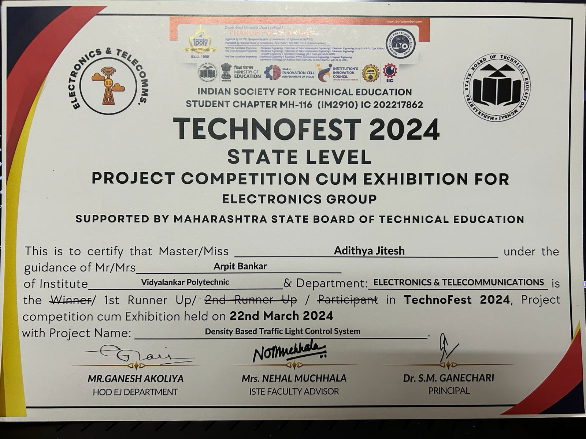
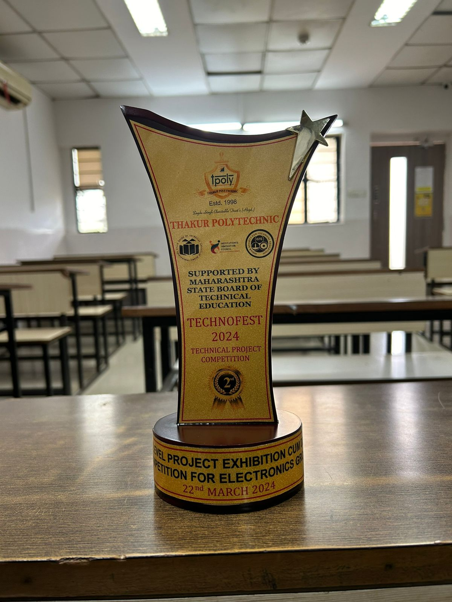
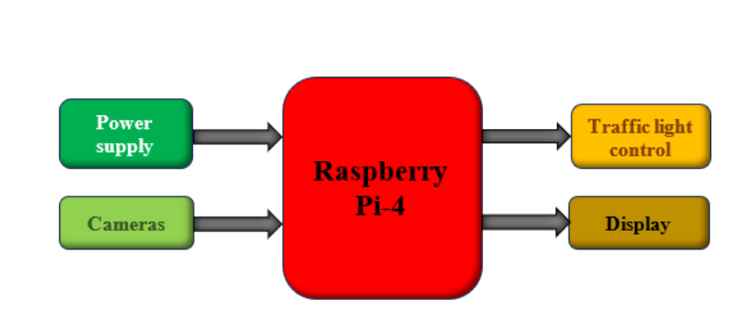
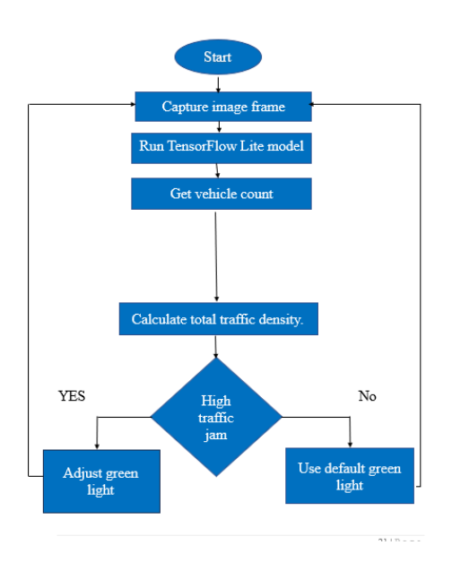
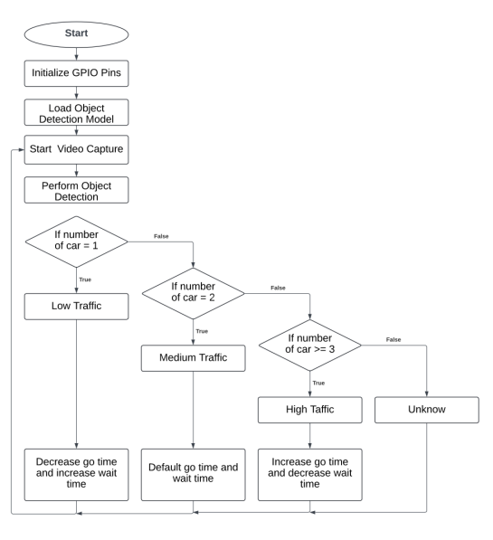
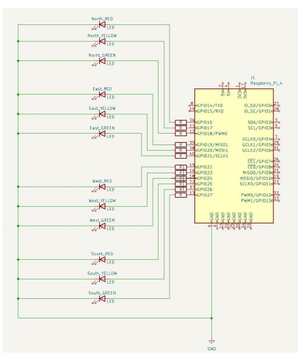
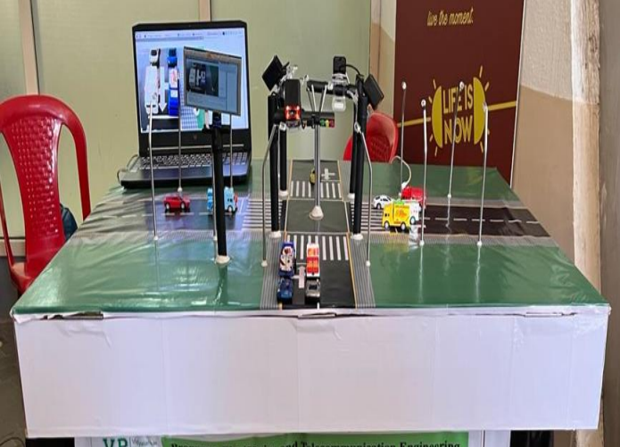
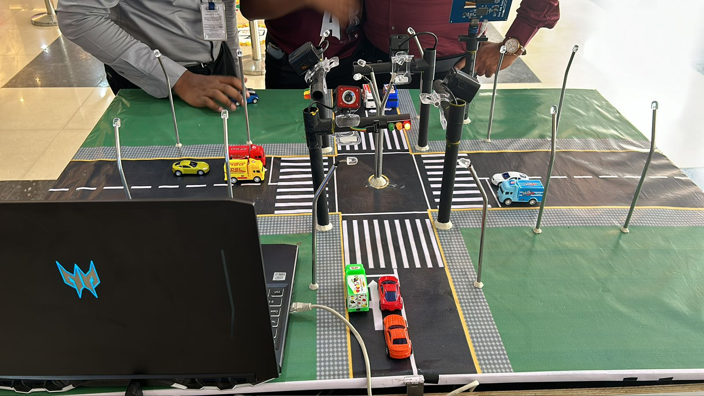
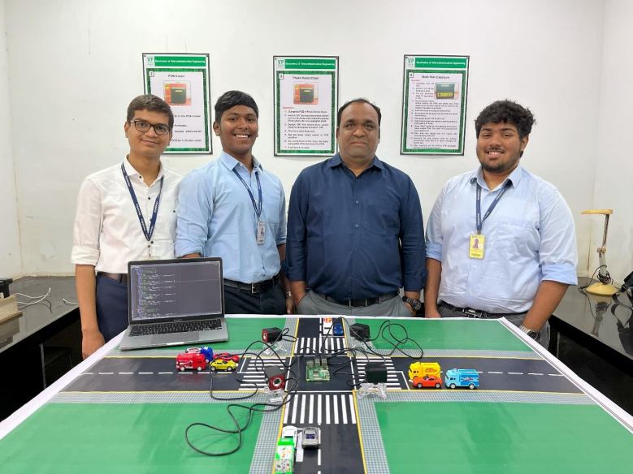

# 🚦 Density-Based Traffic Light Control System

> **🏆 2nd Runner Up — TechnoFest 2024**
> State Level Project Competition cum Exhibition for Electronics Group
> Supported by Maharashtra State Board of Technical Education
> *Thakur Polytechnic, 22nd March 2024*

---

## 📌 Overview

A smart traffic light control system that uses **real-time computer vision** to detect vehicle density at intersections and **automatically adjusts signal timing** to reduce congestion. Instead of fixed timers, the system uses a camera and a TensorFlow Lite object detection model running on a **Raspberry Pi 4** to count vehicles and adapt green light duration accordingly.

This project was built and demonstrated as a working physical model with a 4-way intersection layout, toy vehicles simulating real traffic, and live LED traffic lights controlled via GPIO pins.

---

## 🏅 Award

| Event | Result |
|---|---|
| TechnoFest 2024 — State Level Project Exhibition | **2nd Runner Up (1st Runner Up)** |
| Organized by | Thakur Polytechnic, supported by MSBTE |
| Date | 22nd March 2024 |
| Category | Electronics & Telecommunications |

<p align="center">
  
  &nbsp;&nbsp;
  
</p>

---

## 🎯 Problem Statement

Traditional traffic lights operate on **fixed time cycles**, regardless of actual vehicle volume. This leads to:
- Long unnecessary wait times on empty roads
- Congestion build-up during high-traffic periods
- Fuel wastage and increased emissions

Our system solves this by making signal timing **dynamic and density-aware**.

---

## ⚙️ How It Works

1. A camera mounted above the intersection captures a live video feed
2. Each frame is processed through a **TensorFlow Lite object detection model** (`best.tflite`)
3. The number of detected vehicles determines the traffic density level:

| Vehicles Detected | Density Level | Signal Behaviour |
|---|---|---|
| 1 | Low Traffic | Red — shorter green time |
| 2 | Medium Traffic | Yellow — default timing |
| ≥ 3 | High Traffic | Green — extended green time |

4. The Raspberry Pi 4 sends GPIO signals to control the LEDs for all four directions (North, East, West, South)

---

## 🗺️ System Architecture

### Block Diagram

<p align="center">
  
</p>

### Project Flow

<p align="center">
  
</p>

### Program Logic

<p align="center">
  
</p>

---

## 🔌 Circuit Design

12 LEDs (Red, Yellow, Green × 4 directions) are connected directly to the Raspberry Pi 4's GPIO pins using BCM numbering:

| Direction | Red | Yellow | Green |
|---|---|---|---|
| North | GPIO 17 | GPIO 18 | GPIO 27 |
| East | GPIO 22 | GPIO 23 | GPIO 24 |
| West | GPIO 5 | GPIO 6 | GPIO 13 |
| South | GPIO 19 | GPIO 20 | GPIO 21 |

<p align="center">
  
</p>

---

## 🛠️ Hardware

- **Raspberry Pi 4** — main processing unit
- **Camera Module / USB Webcam** — vehicle detection
- **LEDs** — Red, Yellow, Green × 4 directions (12 total)
- **Resistors** — current limiting for LEDs
- **Custom road model** — 4-way intersection built on a board
- **Toy vehicles** — used to simulate real traffic density

<p align="center">
  
</p>

<p align="center">
  
</p>

---

## 💻 Software & Tech Stack

| Component | Technology |
|---|---|
| Object Detection | TensorFlow Lite (`best.tflite`) |
| Computer Vision | OpenCV (`cv2`) |
| Hardware Control | RPi.GPIO |
| Language | Python 3 |
| Platform | Raspberry Pi 4 (Raspbian OS) |
| ML Framework | TFLite Support (`tflite_support`) |

---

## 🚀 Running the Project

### Prerequisites

```bash
pip install opencv-python tflite-support RPi.GPIO
```

### Run

```bash
python detect.py --model best.tflite --cameraId 0 --frameWidth 640 --frameHeight 480 --numThreads 4
```

### Optional Flags

| Flag | Description | Default |
|---|---|---|
| `--model` | Path to `.tflite` model | `best.tflite` |
| `--cameraId` | Camera index | `0` |
| `--frameWidth` | Frame width | `640` |
| `--frameHeight` | Frame height | `480` |
| `--numThreads` | CPU threads | `4` |
| `--enableEdgeTPU` | Use Edge TPU | `False` |

---

## 👥 Team

<p align="center">
  
</p>

- **Adithya Jithesh**
- **Siberaja Nadar**
- **Ayush Parate**

Guided by **Arpit Bankar**, Vidyalankar Polytechnic

---

## 📄 License

This project was developed for academic and competition purposes.
TensorFlow Lite detection scaffold adapted from [TensorFlow Examples](https://github.com/tensorflow/examples) under the Apache 2.0 License.
